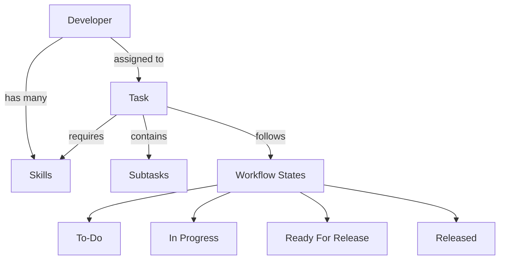

# .NET 9 Enterprise Web API Template - Development Team Task Board

[](https://github.com/yourusername/SoftwareEngineerSkills/actions/workflows/dotnet.yml)
[](LICENSE)
[](https://dotnet.microsoft.com/download)

A production-ready .NET 9 Web API template implementing enterprise-level best practices for building scalable, maintainable, and secure APIs following Clean Architecture and Domain-Driven Design principles.

## Project Overview

This project serves as both a **comprehensive enterprise template** and a **practical example** of a development team task board implementation. It demonstrates real-world application of modern software engineering principles through a domain that developers can easily understand and relate to.

### Dual Purpose

**🏗️ Enterprise Template**
- Production-ready .NET 9 Web API architecture
- Clean Architecture with Domain-Driven Design
- Complete testing strategy and CI/CD pipeline
- Enterprise-grade security, observability, and performance optimization

**📋 Development Team Task Board Example**
- Task management with skill requirements
- Developer profiles with skill capabilities
- Intelligent task-to-developer assignment system
- Hierarchical task structure with subtasks
- Comprehensive workflow state tracking

### Core Domain Features

The system models real-world software development scenarios:

- **Task Management**: Create, organize, and track development tasks with skill requirements
- **Developer Profiles**: Manage team members with their skill sets and proficiency levels
- **Smart Assignment**: Match tasks to developers based on required vs. available skills
- **Workflow States**: Track progress through defined states (To-Do → In Progress → Ready For Release → Released)
- **Hierarchical Tasks**: Support for parent tasks and subtasks with dependency management
- **Skill Evolution**: Track how developer skills improve over time through task completion

### Why This Domain?

We chose a development team task board because:
- **Familiar Context**: Every developer understands task management and team dynamics
- **Complex Relationships**: Rich domain with entities, value objects, and business rules
- **Real Business Value**: Actual useful functionality for development teams
- **Scalable Complexity**: Can be extended with sprint planning, time tracking, reporting, etc.
- **Educational Value**: Perfect for learning Clean Architecture and DDD patterns

## Table of Contents
- [Project Overview](#project-overview)
- [Architecture Overview](#architecture-overview)
- [Key Features](#key-features)
- [Domain Example: Task Board](#domain-example-task-board)
- [Getting Started](#getting-started)
  - [Prerequisites](#prerequisites)
  - [Installation](#installation)
  - [Configuration](#configuration)
- [Project Structure](#project-structure)
- [Design Patterns & Principles](#design-patterns--principles)
- [API Documentation](#api-documentation)
- [Testing](#testing)
- [Observability](#observability)
- [Security](#security)
- [Performance Optimization](#performance-optimization)
- [CI/CD & DevOps](#cicd--devops)
- [Contributing](#contributing)
- [License](#license)
- [Support](#support)
- [Documentation](#documentation)

## Architecture Overview

This template implements **Clean Architecture** with a focus on **Domain-Driven Design** principles and **Screaming Architecture**. The solution is organized into multiple layers with clear separation of concerns:

```
SoftwareEngineerSkills/
├── src
│   ├── SoftwareEngineerSkills.Domain         # Entities, Value Objects, Domain Events
│   ├── SoftwareEngineerSkills.Application    # Business Logic, Commands, Queries
│   ├── SoftwareEngineerSkills.Common         # Shared utilities and helpers
│   ├── SoftwareEngineerSkills.Infrastructure # Data Access, External Services
│   └── SoftwareEngineerSkills.API            # Controllers, Middleware, Configuration
└── tests
    ├── SoftwareEngineerSkills.Domain.UnitTests
    ├── SoftwareEngineerSkills.Application.UnitTests
    ├── SoftwareEngineerSkills.Infrastructure.UnitTests
    ├── SoftwareEngineerSkills.API.UnitTests
    └── SoftwareEngineerSkills.IntegrationTests
```

Additional documentation is maintained in the `Docs/` folder, covering architectural decisions, patterns, and implementation details.

## Key Features

### Core Technologies
- **.NET 9 / ASP.NET Core** - Latest framework version
- **C# 14+** - Modern language features
- **Entity Framework Core 9** - Data access (abstracted via Repository Pattern)

### Architecture & Design Patterns
- **Clean Architecture** with DDD principles and Screaming Architecture
- **CQRS with MediatR** for separating read and write operations
- **Repository Pattern with Unit of Work** for data access abstraction
- **IOptions Pattern** for strongly-typed configuration management
- **Result Pattern** for exception-free error handling 
- **Invariant Validation System** for domain entity consistency
- **Domain Events** with thread-safe handling and version tracking
- **Entity Auditing System** with sophisticated tracking and soft delete capabilities
- **Rich Domain Model** with base entity classes, value objects, and aggregates

### API Documentation & Versioning
- **OpenAPI/Swagger** using Swashbuckle for API documentation
- **API Versioning** support for backward compatibility

### Testing Framework
- **xUnit** for unit and integration tests
- **Moq** for mocking dependencies
- **FluentAssertions** for readable test assertions
- **Testcontainers** for integration testing with real dependencies

### Observability Stack
- **Structured logging** with Serilog
- **OpenTelemetry** for distributed tracing
- **Health checks** implementation for monitoring
- **Metrics exposure** (Prometheus/AppMetrics)
- **Correlation ID tracking** across service calls

### Security Features
- **JWT/OAuth2 authentication** and authorization
- **HTTPS enforcement** with proper configuration
- **FluentValidation** for comprehensive input validation
- **CORS policy** configuration
- **Secrets management** solution

### Performance Optimizations
- **Async/await** implementation throughout
- **Caching strategy** (In-memory/Redis)
- **Response compression** middleware
- **Rate limiting** implementation

### Operational Features
- **Dependency injection** configuration
- **Background job processing**
- **Feature flags** implementation
- **Resilience patterns** using Polly
- **Docker containerization**
- **CI/CD pipeline** with GitHub Actions

## Domain Example: Task Board

This template demonstrates Clean Architecture and DDD principles through a practical **Development Team Task Board** domain. The implementation showcases how complex business scenarios can be modeled using enterprise-grade patterns.

### Business Domain

The task board system manages the relationship between development tasks and team members:



### Core Entities & Aggregates

**🧑‍💻 Developer Aggregate**
- **Identity**: Unique developer profile
- **Skills**: Collection of technical capabilities with proficiency levels
- **Assignments**: Current and historical task assignments
- **Availability**: Workload and capacity management

**📋 Task Aggregate**
- **Identity**: Unique task identification
- **Requirements**: Skills needed to complete the task
- **Hierarchy**: Parent-child relationships for complex work items
- **State Management**: Workflow progression through defined states
- **Assignment Logic**: Rules for matching tasks to developers

**🎯 Skill Value Object**
- **Immutable**: Represents a specific technical capability
- **Categorization**: Groups skills by technology, methodology, or domain
- **Proficiency Levels**: Beginner, Intermediate, Advanced, Expert

### Business Rules Examples

The domain enforces real-world constraints:

- **Skill Matching**: Tasks can only be assigned to developers with required skills
- **Capacity Management**: Developers have maximum concurrent task limits
- **Dependency Validation**: Subtasks cannot be completed before parent tasks
- **State Transitions**: Tasks must follow defined workflow progressions
- **Competency Growth**: Developer skills can improve through task completion

### API Endpoints Preview

```http
# Developer Management
GET    /api/v1/developers
POST   /api/v1/developers
GET    /api/v1/developers/{id}
PUT    /api/v1/developers/{id}/skills

# Task Management  
GET    /api/v1/tasks
POST   /api/v1/tasks
GET    /api/v1/tasks/{id}
PUT    /api/v1/tasks/{id}/assign/{developerId}
PUT    /api/v1/tasks/{id}/state

# Assignment & Analytics
GET    /api/v1/assignments/optimal-match/{taskId}
GET    /api/v1/analytics/skill-gaps
GET    /api/v1/analytics/developer-workload
```

### Learning Outcomes

This domain example teaches:

- **Aggregate Design**: How to identify and model aggregate boundaries
- **Value Objects**: When and how to use immutable domain concepts
- **Domain Events**: Cross-aggregate communication patterns
- **Business Rules**: Implementing and testing complex domain logic
- **CQRS Patterns**: Separating command and query responsibilities
- **Repository Design**: Data access abstraction and testing strategies

## Getting Started

### Prerequisites

- [.NET 9 SDK](https://dotnet.microsoft.com/download)
- [Docker Desktop](https://www.docker.com/products/docker-desktop) (optional, for containerization)
- IDE of choice ([Visual Studio 2022+](https://visualstudio.microsoft.com/vs/), [VS Code](https://code.visualstudio.com/), [JetBrains Rider](https://www.jetbrains.com/rider/))

### Installation

1. Clone this repository:
```bash
git clone https://github.com/yourusername/SoftwareEngineerSkills.git
cd SoftwareEngineerSkills
```

2. Build the solution:
```bash
dotnet build
```

3. Run the API:
```bash
cd SoftwareEngineerSkills/src/SoftwareEngineerSkills.API
dotnet run
```

4. Navigate to `https://localhost:5001/swagger` to view the API documentation.

### Configuration

The template uses the IOptions pattern for configuration management:

1. Update settings in `appsettings.json` or use environment-specific files like `appsettings.Development.json`
2. For sensitive data, use:
   - User Secrets during development (`dotnet user-secrets`)
   - Environment variables
   - Azure Key Vault or other secret management solutions for production

## Project Structure

The solution follows Clean Architecture principles with these main projects:

### Core Layers
- **SoftwareEngineerSkills.Domain**: Contains entities, value objects, enums, exceptions, interfaces, and domain events
- **SoftwareEngineerSkills.Application**: Contains business logic, commands/queries (CQRS), validators, and application services
- **SoftwareEngineerSkills.Common**: Contains shared utilities and helpers used across layers

### Infrastructure Layer
- **SoftwareEngineerSkills.Infrastructure**: External service implementations, logging, persistence, repositories, configuration, and other concerns

### API Layer
- **SoftwareEngineerSkills.API**: Controllers, filters, middleware, API versioning, and Swagger configuration

### Tests
- **Unit Tests**: For testing individual components in isolation (one project per layer)
- **Integration Tests**: For testing components across different layers with their dependencies

- **FunctionalTests**: For testing the API endpoints from client perspective

## Design Patterns & Principles

### Clean Architecture
The solution is structured around the dependency rule where dependencies flow inward, with the Domain at the center. External concerns like UI, database, and third-party services are on the outer layers.

### Domain-Driven Design
- **Entities**: Domain objects with identity and lifecycle
  - `BaseEntity`: Base class with ID, versioning, and invariant validation
  - `SoftDeleteEntity`: Extended base class with soft deletion capabilities
- **Value Objects**: Immutable domain objects without identity
  - `ValueObject`: Abstract base class with equality comparison
- **Domain Events**: For side-effect processing
  - Thread-safe implementation with version tracking
- **Aggregates**: Cluster of domain objects treated as a single unit
  - `AggregateRoot`: Base class with domain event handling and boundary enforcement
  - `IAggregateRoot`: Interface defining aggregate responsibilities
- **Invariant Validation**: System to enforce business rules
  - `DomainValidationException`: Exception for invariant violations
  - Supports both synchronous and asynchronous validation

### CQRS (Command Query Responsibility Segregation)
- **Commands**: For write operations that change state
- **Queries**: For read operations that return data without changing state
- **MediatR**: Used to dispatch commands and queries

### Repository Pattern
- Abstracts data access
- Provides collection-like interface for domain entities
- Coupled with Unit of Work for transaction management
- Specialized repositories for soft-deletable entities
- EF Core extensions for working with soft-deleted entities

### Entity Auditing System
- `IAuditableEntity`: Interface for tracking entity changes
- Captures creation/modification timestamps and user information
- Soft delete functionality via `ISoftDelete` interface
- Automatic audit property management through DbContext

### Result Pattern
- Eliminates exceptions for expected error paths
- Returns rich result objects with status, errors, and data

## API Documentation

API documentation is automatically generated using Swagger/OpenAPI:

- **Swagger UI**: Available at `/swagger` endpoint
- **API Versioning**: Supports URL path, query string, and header versioning
- **XML Comments**: Used to document API endpoints and models

## Testing

### Unit Testing
- Uses xUnit as the test framework
- Moq for creating test doubles
- FluentAssertions for more readable assertions

### Integration Testing
- Testcontainers for testing with real database and dependencies
- In-memory database for faster tests
- Respects application boundaries

### Functional Testing
- Tests the entire application stack
- Uses WebApplicationFactory to bootstrap the application
- Real HTTP requests against in-memory test server

## Observability

### Logging
- Structured logging with Serilog
- Multiple sinks configuration (Console, File, Elasticsearch)
- Log enrichment with contextual information

### Tracing
- OpenTelemetry integration for distributed tracing
- Trace context propagation
- Exporters for Jaeger/Zipkin/other tracing systems

### Health Checks
- Endpoint: `/health` provides system health
- Custom health checks for critical dependencies
- Integration with monitoring systems

### Metrics
- Exposes application metrics in Prometheus format
- Custom metrics for business KPIs
- Dashboard templates included

## Security

### Authentication & Authorization
- JWT Bearer token authentication
- Role-based and policy-based authorization
- OAuth2/OpenID Connect support

### Data Protection
- Input validation using FluentValidation
- Output sanitization to prevent XSS
- HTTPS enforcement
- Proper CORS configuration

### Security Headers
- Content Security Policy
- X-Content-Type-Options
- X-Frame-Options
- And other security headers

## Performance Optimization

### Caching
- Response caching middleware
- Distributed cache abstraction with Redis implementation
- Cache invalidation strategy

### Asynchronous Processing
- Async/await usage throughout the codebase
- Task-based Asynchronous Pattern
- Background job processing for long-running tasks

### Efficiency
- Response compression
- Rate limiting to protect resources
- Pagination for large result sets

## CI/CD & DevOps

### Containerization
- Dockerfile and docker-compose configuration
- Multi-stage builds for optimized images
- Container orchestration support (Kubernetes manifests)

### GitHub Actions
- Build and test workflows
- Code quality analysis
- Security scanning
- Automated deployments

### Infrastructure as Code
- Deployment templates for Azure/AWS
- Environment configuration
- Resource provisioning scripts

### Version Control & Releases
- Semantic Versioning for clear release management
- [CHANGELOG.md](CHANGELOG.md) maintained following Keep a Changelog format
- Defined release process with versioning strategy

## Contributing

We welcome contributions! Please follow these steps:

1. Fork the repository
2. Create your feature branch (`git checkout -b feature/amazing-feature`)
3. Commit your changes (`git commit -m 'Add some amazing feature'`)
4. Push to the branch (`git push origin feature/amazing-feature`)
5. Open a Pull Request

Please ensure your code adheres to our coding standards and includes appropriate tests.

## License

This project is licensed under the MIT License - see the [LICENSE](LICENSE) file for details.

## Support

If you need help with this template, please:

- Open an issue on GitHub
- Check the layer-specific documentation in each project's README file
- Review the [CHANGELOG.md](CHANGELOG.md) for recent updates
- Contact the maintainers at [example@example.com](mailto:example@example.com)
- Join our community on [Discord](https://discord.gg/example)

---

## 🌟 Star this repository if you find it useful! 🌟

## Documentation

Each layer of the Clean Architecture has its own detailed documentation:

### Layer-Specific Documentation
- **[Domain Layer](src/SoftwareEngineerSkills.Domain/README.md)**: Comprehensive guide to Domain-Driven Design implementation, entities, value objects, domain events, and invariant validation
- **[Application Layer](src/SoftwareEngineerSkills.Application/README.md)**: CQRS implementation, commands, queries, handlers, and application services
- **[Infrastructure Layer](src/SoftwareEngineerSkills.Infrastructure/README.md)**: Repository patterns, Entity Framework configuration, external service integrations, and data access
- **[API Layer](src/SoftwareEngineerSkills.API/README.md)**: Controllers, middleware, authentication, API versioning, and Swagger configuration
- **[Common Layer](src/SoftwareEngineerSkills.Common/README.md)**: Shared utilities, extensions, and cross-cutting concerns

### Additional Resources
- **[CHANGELOG.md](CHANGELOG.md)**: Complete record of all notable changes and version history
- **API Documentation**: Interactive Swagger UI available at `/swagger` endpoint when running the application
- **Architecture Decision Records**: Documented within each layer's README for context-specific decisions

### Quick Navigation
For specific topics, refer to the appropriate layer documentation:
- **Domain modeling and business rules** → [Domain Layer README](src/SoftwareEngineerSkills.Domain/README.md)
- **CQRS patterns and handlers** → [Application Layer README](src/SoftwareEngineerSkills.Application/README.md)
- **Data access and repositories** → [Infrastructure Layer README](src/SoftwareEngineerSkills.Infrastructure/README.md)
- **API endpoints and configuration** → [API Layer README](src/SoftwareEngineerSkills.API/README.md)
- **Shared utilities and helpers** → [Common Layer README](src/SoftwareEngineerSkills.Common/README.md)
