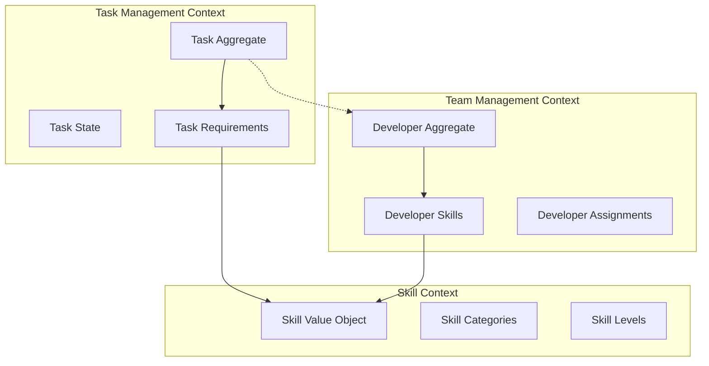

# Domain Layer Reference Guide - Development Team Task Board

## Overview

The Domain Layer is the core of the **Development Team Task Board** application, implementing Domain-Driven Design (DDD) principles within Clean Architecture. This system models the real-world scenario of managing development tasks and team member assignments based on skills and capabilities.

### Business Domain: Development Team Task Management

The application models a sophisticated task board system where:
- **Development teams** manage workloads through structured task assignments
- **Tasks** require specific technical skills and follow defined workflows
- **Developers** possess skills with varying proficiency levels
- **Smart assignment** matches tasks to developers based on skill requirements
- **Project management** tracks progress through hierarchical task structures

### Domain Boundaries and Context



**Key Principles:**
- **Rich Domain Model**: Entities encapsulate both data and behavior
- **Dependency Rule**: No external dependencies - domain is technology-independent
- **Event-Driven Design**: Domain events for cross-aggregate communication
- **Invariant Validation**: Business rules enforced through comprehensive validation
- **Thread Safety**: Aggregate roots provide thread-safe domain event handling

## Table of Contents
- [Overview](#overview)
- [Core Components](#core-components)
  - [BaseEntity - Foundation Class](#baseentity---foundation-class)
  - [AggregateRoot - Enhanced Aggregate Boundary](#aggregateroot---enhanced-aggregate-boundary)
  - [ValueObject - Immutable Domain Concepts](#valueobject---immutable-domain-concepts)
  - [SoftDeleteEntity - Soft Deletion Support](#softdeleteentity---soft-deletion-support)
- [Domain Model: Development Team Task Board](#domain-model-development-team-task-board)
  - [Core Aggregates](#core-aggregates)
  - [Core Value Objects](#core-value-objects)
  - [Domain Enumerations](#domain-enumerations)
  - [Key Business Rules](#key-business-rules)
  - [Domain Events](#domain-events)
- [Implementation Patterns](#implementation-patterns)
- [Advanced Event Handling Patterns](#advanced-event-handling-patterns)
- [Domain Modeling Workflow](#domain-modeling-workflow)
- [Exception Handling](#exception-handling)
- [Project Structure](#project-structure)
- [Best Practices](#best-practices)
- [Testing Guidelines](#testing-guidelines)
- [Interfaces Reference](#interfaces-reference)
- [Key Implementation Notes](#key-implementation-notes)
- [Quick Start Checklist](#quick-start-checklist)

## Core Components

### BaseEntity - Foundation Class

Provides identity, auditing, domain events, and validation for all domain entities:

```csharp
public abstract class BaseEntity : IAuditableEntity
{
    // Identity & Versioning
    public Guid Id { get; protected set; } = Guid.NewGuid();
    public int Version { get; private set; }
    
    // Audit Properties
    public DateTime Created { get; set; }
    public string? CreatedBy { get; set; }
    public DateTime? LastModified { get; set; }
    public string? LastModifiedBy { get; set; }
    
    // Domain Events (basic implementation)
    public IReadOnlyCollection<IDomainEvent> DomainEvents { get; }
    
    // Invariant Validation System
    protected virtual IEnumerable<string> CheckInvariants()
    protected virtual Task<IEnumerable<string>> CheckInvariantsAsync(CancellationToken cancellationToken = default)
    public void EnforceInvariants()
    public async Task EnforceInvariantsAsync(CancellationToken cancellationToken = default)
    
    // Event Management
    public void AddDomainEvent(IDomainEvent domainEvent)
    public bool RemoveDomainEvent(IDomainEvent domainEvent)
    public void ClearDomainEvents()
    
    // Version Control
    public void IncrementVersion()
}
```

**Features:**
- **Unique Identity**: GUID-based identification
- **Audit Support**: Full `IAuditableEntity` implementation
- **Version Control**: Optimistic concurrency through version incrementing
- **Domain Events**: Built-in event handling for cross-aggregate communication
- **Business Rule Validation**: Sync/async invariant validation with `DomainValidationException`

### AggregateRoot - Enhanced Aggregate Boundary

Extends BaseEntity with thread-safe domain event handling and advanced event patterns:

```csharp
public abstract class AggregateRoot : BaseEntity, IAggregateRoot
{
    // Thread-safe event handling
    protected new void AddDomainEvent(IDomainEvent domainEvent) // Thread-safe + auto version increment
    public new void RemoveDomainEvent(IDomainEvent domainEvent) // Thread-safe
    public new void ClearDomainEvents() // Thread-safe
    
    // Event Sourcing Patterns
    protected virtual void Apply(IDomainEvent domainEvent)
    protected void AddAndApplyEvent(IDomainEvent domainEvent)
    protected async Task AddAndApplyEventAsync(IDomainEvent domainEvent)
    
    // Async invariant validation
    public Task EnforceInvariantsAsync()
}
```

**Key Enhancements:**
- **Thread Safety**: All domain event operations are thread-safe using internal locking
- **Automatic Versioning**: Version incremented automatically when events are added
- **Event Sourcing Support**: `Apply` pattern for event-driven state changes
- **Composite Operations**: `AddAndApplyEvent` methods combine event application with collection management

### ValueObject - Immutable Domain Concepts

Abstract base for immutable value types identified by their properties:

```csharp
public abstract class ValueObject
{
    protected abstract IEnumerable<object> GetEqualityComponents();
    
    public override bool Equals(object? obj) { /* ... */ }
    public override int GetHashCode() { /* ... */ }
    public static bool operator ==(ValueObject? left, ValueObject? right) { /* ... */ }
}

// Example Implementation
public class Address : ValueObject
{
    public string Street { get; private set; }
    public string City { get; private set; }
    // ... other properties
    
    public Address(string street, string city, /* ... */)
    {
        Street = Guard.Against.NullOrWhiteSpace(street, nameof(street));
        // ... validation and assignment
    }
    
    protected override IEnumerable<object> GetEqualityComponents()
    {
        yield return Street;
        yield return City;
        // ... other components
    }
}
```

### SoftDeleteEntity - Soft Deletion Support

For entities requiring soft deletion capabilities:

```csharp
public abstract class SoftDeleteEntity : BaseEntity, ISoftDelete
{
    public bool IsDeleted { get; private set; }
    public DateTime? DeletedAt { get; private set; }
    public string? DeletedBy { get; private set; }
    
    public virtual void SoftDelete(string deletedBy)
    {
        if (IsDeleted) return;
        
        IsDeleted = true;
        DeletedAt = DateTime.UtcNow;
        DeletedBy = Guard.Against.NullOrWhiteSpace(deletedBy, nameof(deletedBy));
        
        AddDomainEvent(new EntitySoftDeletedEvent(Id, GetType().Name));
        EnforceInvariants();    }
}
```

## Domain Model: Development Team Task Board

### Core Aggregates

The task board domain is organized around three main aggregates that represent the business's core entities:

#### 1. **Task Aggregate** 🎯
The central work unit that drives the entire system:

```csharp
public class Task : AggregateRoot
{
    public string Title { get; private set; }
    public string Description { get; private set; }
    public TaskStatus Status { get; private set; }
    public TaskPriority Priority { get; private set; }
    public DateTime? DueDate { get; private set; }
    public Guid? AssignedDeveloperId { get; private set; }
    public Guid? ParentTaskId { get; private set; }
    
    // Skill requirements for this task
    private readonly List<TaskSkillRequirement> _skillRequirements = new();
    public IReadOnlyCollection<TaskSkillRequirement> SkillRequirements => _skillRequirements.AsReadOnly();
    
    // Subtasks hierarchy
    private readonly List<Guid> _subtaskIds = new();
    public IReadOnlyCollection<Guid> SubtaskIds => _subtaskIds.AsReadOnly();
    
    // Business behavior
    public void AssignToDeveloper(Guid developerId, IEnumerable<DeveloperSkill> developerSkills)
    public void UpdateStatus(TaskStatus newStatus)
    public void AddSkillRequirement(SkillCategory category, SkillLevel minimumLevel)
    public void AddSubtask(Guid subtaskId)
    public bool CanBeAssignedTo(IEnumerable<DeveloperSkill> developerSkills)
}
```

**Key Capabilities:**
- **Hierarchical Structure**: Tasks can have subtasks for complex work breakdown
- **Skill-Based Assignment**: Only developers with required skills can be assigned
- **Workflow Management**: Status transitions follow business rules
- **Dependency Tracking**: Parent-child task relationships with validation

#### 2. **Developer Aggregate** 👨‍💻
Represents team members with their capabilities and assignments:

```csharp
public class Developer : AggregateRoot
{
    public string FirstName { get; private set; }
    public string LastName { get; private set; }
    public string Email { get; private set; }
    public string Position { get; private set; }
    public DateTime HireDate { get; private set; }
    public bool IsActive { get; private set; }
    
    // Developer's skill portfolio
    private readonly List<DeveloperSkill> _skills = new();
    public IReadOnlyCollection<DeveloperSkill> Skills => _skills.AsReadOnly();
    
    // Current task assignments
    private readonly List<Guid> _assignedTaskIds = new();
    public IReadOnlyCollection<Guid> AssignedTaskIds => _assignedTaskIds.AsReadOnly();
    
    // Business behavior
    public void AddSkill(SkillCategory category, SkillLevel level)
    public void UpdateSkillLevel(SkillCategory category, SkillLevel newLevel)
    public void AssignTask(Guid taskId)
    public void UnassignTask(Guid taskId)
    public bool HasRequiredSkills(IEnumerable<TaskSkillRequirement> requirements)
    public int CalculateWorkload()
}
```

**Key Capabilities:**
- **Skill Management**: Track technical capabilities with proficiency levels
- **Workload Balancing**: Monitor current assignments and capacity
- **Career Growth**: Skills can evolve over time
- **Assignment Validation**: Ensure developers can handle assigned tasks

#### 3. **Project Aggregate** 📋
Organizes tasks into larger business initiatives:

```csharp
public class Project : AggregateRoot
{
    public string Name { get; private set; }
    public string Description { get; private set; }
    public DateTime StartDate { get; private set; }
    public DateTime? EndDate { get; private set; }
    public ProjectStatus Status { get; private set; }
    public Guid ProjectManagerId { get; private set; }
    
    // Project task collection
    private readonly List<Guid> _taskIds = new();
    public IReadOnlyCollection<Guid> TaskIds => _taskIds.AsReadOnly();
    
    // Business behavior
    public void AddTask(Guid taskId)
    public void RemoveTask(Guid taskId)
    public void UpdateStatus(ProjectStatus newStatus)
    public void SetDeadline(DateTime deadline)
    public ProjectProgress CalculateProgress()
}
```

### Core Value Objects

#### **Skill Value Object** 🏷️
Represents a specific technical capability:

```csharp
public class Skill : ValueObject
{
    public SkillCategory Category { get; private set; }
    public string Name { get; private set; }
    public string Description { get; private set; }
    
    protected override IEnumerable<object> GetEqualityComponents()
    {
        yield return Category;
        yield return Name.ToLowerInvariant();
    }
}
```

#### **DeveloperSkill Value Object** 💪
Combines a skill with a developer's proficiency level:

```csharp
public class DeveloperSkill : ValueObject
{
    public Skill Skill { get; private set; }
    public SkillLevel Level { get; private set; }
    public DateTime AcquiredDate { get; private set; }
    public DateTime? LastUsedDate { get; private set; }
    
    public bool MeetsRequirement(TaskSkillRequirement requirement)
    {
        return Skill.Category == requirement.Category && 
               Level >= requirement.MinimumLevel;
    }
}
```

#### **TaskSkillRequirement Value Object** ✅
Defines what skills a task needs:

```csharp
public class TaskSkillRequirement : ValueObject
{
    public SkillCategory Category { get; private set; }
    public SkillLevel MinimumLevel { get; private set; }
    public bool IsRequired { get; private set; }
    public string Justification { get; private set; }
    
    protected override IEnumerable<object> GetEqualityComponents()
    {
        yield return Category;
        yield return MinimumLevel;
        yield return IsRequired;
    }
}
```

### Domain Enumerations

```csharp
// Task workflow states
public enum TaskStatus
{
    Todo = 1,
    InProgress = 2,
    InReview = 3,
    ReadyForRelease = 4,
    Released = 5,
    Cancelled = 6
}

// Task importance levels
public enum TaskPriority
{
    Low = 1,
    Medium = 2,
    High = 3,
    Critical = 4
}

// Project lifecycle states
public enum ProjectStatus
{
    Planning = 1,
    Active = 2,
    OnHold = 3,
    Completed = 4,
    Cancelled = 5
}
```

### Key Business Rules

#### Task Assignment Rules
- **Skill Matching**: Developers must possess required skills at minimum proficiency level
- **Workload Limits**: Developers cannot exceed maximum concurrent task assignments
- **Hierarchy Validation**: Subtasks cannot be marked complete before parent tasks
- **Status Progression**: Tasks must follow defined workflow transitions

#### Developer Management Rules
- **Skill Progression**: Skills can only advance to higher levels, never regress
- **Assignment Capacity**: Active developers have maximum concurrent task limits
- **Skill Requirements**: Some advanced tasks require multiple complementary skills

#### Project Organization Rules
- **Task Ownership**: Each task belongs to exactly one project
- **Timeline Consistency**: Project deadlines must align with task due dates
- **Status Dependencies**: Project completion requires all tasks to be finished

### Domain Events

Key events that drive cross-aggregate communication:

```csharp
// Task-related events
public class TaskCreatedEvent : DomainEvent { /* ... */ }
public class TaskAssignedEvent : DomainEvent { /* ... */ }
public class TaskStatusChangedEvent : DomainEvent { /* ... */ }
public class TaskCompletedEvent : DomainEvent { /* ... */ }

// Developer-related events  
public class DeveloperSkillAddedEvent : DomainEvent { /* ... */ }
public class DeveloperSkillLevelIncreasedEvent : DomainEvent { /* ... */ }
public class DeveloperAssignedToTaskEvent : DomainEvent { /* ... */ }

// Project-related events
public class ProjectCreatedEvent : DomainEvent { /* ... */ }
public class ProjectStatusChangedEvent : DomainEvent { /* ... */ }
public class ProjectCompletedEvent : DomainEvent { /* ... */ }
```

## Implementation Patterns

### Domain Entity Pattern

```csharp
public class Task : AggregateRoot
{
    // Properties with private setters
    public string Title { get; private set; } = null!;
    public string Description { get; private set; } = null!;
    public TaskStatus Status { get; private set; }
    public TaskPriority Priority { get; private set; }
    public Guid? AssignedDeveloperId { get; private set; }
    
    // Collections with backing fields
    private readonly List<TaskSkillRequirement> _skillRequirements = new();
    public IReadOnlyCollection<TaskSkillRequirement> SkillRequirements => _skillRequirements.AsReadOnly();
    
    // EF Core constructor
    private Task() { }
    
    // Public constructor with validation
    public Task(string title, string description, TaskPriority priority)
    {
        Title = Guard.Against.NullOrWhiteSpace(title, nameof(title));
        Description = Guard.Against.NullOrWhiteSpace(description, nameof(description));
        Priority = priority;
        Status = TaskStatus.Todo;
        
        AddDomainEvent(new TaskCreatedEvent(Id, title, priority));
        EnforceInvariants();
    }
    
    // Behavior methods using enhanced event patterns
    public void AssignToDeveloper(Guid developerId, IEnumerable<DeveloperSkill> developerSkills)
    {
        Guard.Against.Default(developerId, nameof(developerId));
        
        if (!CanBeAssignedTo(developerSkills))
            throw new BusinessRuleException("Developer does not have required skills for this task");
            
        if (AssignedDeveloperId == developerId) return;
            
        var previousDeveloperId = AssignedDeveloperId;
        AssignedDeveloperId = developerId;
        
        // Using AddAndApplyEvent for atomic operation
        AddAndApplyEvent(new TaskAssignedEvent(Id, developerId, previousDeveloperId));
    }
    
    // Event sourcing pattern
    protected override void Apply(IDomainEvent domainEvent)
    {
        switch (domainEvent)
        {
            case TaskAssignedEvent assigned:
                // Additional state changes beyond direct property assignment
                if (Status == TaskStatus.Todo)
                    Status = TaskStatus.InProgress;
                break;
            case TaskStatusChangedEvent statusChanged:
                // Update related metrics or calculations
                break;
        }
    }
    
    // Business rule validation
    protected override IEnumerable<string> CheckInvariants()
    {
        if (string.IsNullOrWhiteSpace(Title))
            yield return "Task title cannot be empty";
            
        if (Title?.Length > 200)
            yield return "Task title cannot exceed 200 characters";
            
        if (Description?.Length > 2000)
            yield return "Task description cannot exceed 2000 characters";
            
        if (AssignedDeveloperId.HasValue && Status == TaskStatus.Todo)
            yield return "Assigned tasks cannot have Todo status";
    }
    
    // Business behavior
    public bool CanBeAssignedTo(IEnumerable<DeveloperSkill> developerSkills)
    {
        return _skillRequirements.All(requirement => 
            developerSkills.Any(skill => skill.MeetsRequirement(requirement)));
    }
    
    public void AddSkillRequirement(SkillCategory category, SkillLevel minimumLevel, bool isRequired = true)
    {
        var requirement = new TaskSkillRequirement(category, minimumLevel, isRequired);
        _skillRequirements.Add(requirement);
        
        AddDomainEvent(new TaskSkillRequirementAddedEvent(Id, category, minimumLevel));
        EnforceInvariants();
    }
}
```

### Domain Events

Events signal important domain occurrences using past tense naming:

```csharp
public interface IDomainEvent
{
    DateTime OccurredOn { get; }
    Guid Id { get; }
}

public abstract class DomainEvent : IDomainEvent
{
    public DateTime OccurredOn { get; }
    public Guid Id { get; }
    
    protected DomainEvent()
    {
        Id = Guid.NewGuid();
        OccurredOn = DateTime.UtcNow;
    }
}

// Example Event
public class TaskCreatedEvent : DomainEvent
{
    public Guid TaskId { get; }
    public string Title { get; }
    public TaskPriority Priority { get; }
    
    public TaskCreatedEvent(Guid taskId, string title, TaskPriority priority)
    {
        TaskId = taskId;
        Title = title;
        Priority = priority;
    }
}
```

## Advanced Event Handling Patterns

### Thread-Safe Event Management (AggregateRoot Only)

```csharp
public class Task : AggregateRoot
{
    public void ProcessConcurrentUpdates()
    {
        // Multiple threads can safely add events
        Parallel.For(0, 10, i =>
        {
            AddDomainEvent(new TaskCommentAddedEvent(Id, $"Comment{i}"));
        });
        
        // Version is automatically incremented for each event
        // Thread-safe operations ensure consistency
    }
}
```

### Event Sourcing Support

```csharp
public class Developer : AggregateRoot
{
    public int TotalTasksCompleted { get; private set; }
    
    public void CompleteTask(Guid taskId)
    {
        // Apply event with automatic validation and event recording
        AddAndApplyEvent(new TaskCompletedByDeveloperEvent(Id, taskId));
    }
    
    protected override void Apply(IDomainEvent domainEvent)
    {
        switch (domainEvent)
        {
            case TaskCompletedByDeveloperEvent completed:
                TotalTasksCompleted++;
                break;
            case TaskAssignedToDeveloperEvent assigned:
                // Update workload metrics
                break;
        }
    }
}
```

### Asynchronous Event Processing

```csharp
public class Developer : AggregateRoot
{
    public async Task UpdateEmailAsync(string newEmail, CancellationToken cancellationToken = default)
    {
        var oldEmail = Email;
        Email = newEmail;        
        // Async event application with validation
        await AddAndApplyEventAsync(new DeveloperEmailChangedEvent(Id, oldEmail, newEmail));
    }
    
    protected override async Task<IEnumerable<string>> CheckInvariantsAsync(CancellationToken cancellationToken = default)
    {
        var errors = new List<string>();
        errors.AddRange(CheckInvariants());
        
        // Async validation requiring I/O
        if (Email != null)
        {
            var emailExists = await emailValidationService.IsEmailInUseAsync(Email, cancellationToken);
            if (emailExists)
                errors.Add("Email address is already in use");
        }
        
        return errors;
    }
}
```

## Domain Modeling Workflow

### 1. Identify Domain Concepts
- Extract key business concepts from requirements
- Distinguish between entities (have identity) and value objects (defined by properties)
- Identify aggregate boundaries (consistency boundaries)

### 2. Define Aggregates
- Determine aggregate roots and their boundaries
- Ensure aggregates maintain consistency internally
- Reference other aggregates by ID only

### 3. Model Entities and Value Objects
- Extend `AggregateRoot` for aggregate roots (recommended for main entities)
- Extend `BaseEntity` for simple entities within aggregates
- Inherit from `ValueObject` for immutable concepts
- Use `SoftDeleteEntity` when soft deletion is required

### 4. Implement Business Behavior
- Add methods that encapsulate domain operations
- Generate domain events for important state changes
- Use `AddAndApplyEvent` for event sourcing patterns
- Implement invariant validation in `CheckInvariants()` and `CheckInvariantsAsync()`

### 5. Define Interfaces
- `IAuditableEntity`: For entities requiring audit trails
- `ISoftDelete`: For entities supporting soft deletion
- `IAggregateRoot`: Marker interface for aggregate roots

## Exception Handling

### Domain Exception Hierarchy

```
DomainException (abstract)
├── BusinessRuleException          # Business rule violations
│   └── DomainValidationException  # Invariant validation failures
└── EntityNotFoundException        # Entity not found scenarios
```

### Usage Examples

```csharp
// Business rule violation
if (!CanBeAssignedTo(developerSkills))
    throw new BusinessRuleException(
        "Developer does not have required skills for this task");

// Invariant validation (automatic via EnforceInvariants)
protected override IEnumerable<string> CheckInvariants()
{
    if (string.IsNullOrWhiteSpace(Title))
        yield return "Task title cannot be empty";
}

// DomainValidationException thrown automatically with all validation errors
```

## Project Structure

```
SoftwareEngineerSkills.Domain/
├── Common/                     # Shared domain infrastructure
│   ├── Base/                   # Base classes for domain entities
│   │   ├── BaseEntity.cs       # Foundation entity with identity, auditing, and validation
│   │   ├── AggregateRoot.cs    # Thread-safe aggregate root with advanced event handling
│   │   └── SoftDeleteEntity.cs # Base class for entities supporting soft deletion
│   └── Events/                 # Domain events infrastructure
│       ├── IDomainEvent.cs     # Domain event interface
│       ├── DomainEvent.cs      # Base domain event implementation
│       └── SoftDeleteEvents.cs # Soft deletion related events
├── Aggregates/                 # Domain aggregates (main business entities)
│   ├── Developer/              # Developer aggregate
│   │   ├── Developer.cs        # Developer aggregate root
│   │   └── DeveloperEvents.cs  # Developer-specific domain events
│   ├── Task/                   # Task aggregate
│   │   ├── Task.cs             # Task aggregate root
│   │   └── TaskEvents.cs       # Task-specific domain events
│   └── Project/                # Project aggregate
│       ├── Project.cs          # Project aggregate root
│       └── ProjectEvents.cs    # Project-specific domain events
├── Enums/                      # Domain enumerations
│   ├── SkillCategory.cs        # Skill categorization enumeration
│   └── SkillLevel.cs           # Skill proficiency level enumeration
├── Exceptions/                 # Domain-specific exception hierarchy
│   ├── DomainException.cs      # Base domain exception
│   ├── BusinessRuleException.cs # Business rule violations
│   ├── DomainValidationException.cs # Invariant validation failures
│   └── EntityNotFoundException.cs # Entity not found scenarios
├── Abstractions/               # Domain interfaces and abstractions
├── DomainServices/             # Domain services for cross-aggregate operations
├── Entities/                   # Additional domain entities
├── Rules/                      # Business rules and specifications
├── Shared/                     # Shared domain utilities
├── ValueObjects/               # Domain value objects
└── README.md                   # This documentation
```

## Best Practices

### Entity Design
✅ **DO:**
- Use `AggregateRoot` for main business entities requiring thread-safe event handling
- Use private setters for properties
- Expose behavior through methods, not property setters
- Validate inputs in constructors and methods
- Always call `EnforceInvariants()` or `EnforceInvariantsAsync()` after state changes
- Use `AddAndApplyEvent` for event sourcing patterns
- Use meaningful domain events with past tense naming

❌ **DON'T:**
- Expose public setters for domain properties
- Allow entities to be in invalid states
- Use domain entities as data transfer objects
- Reference other aggregates directly (use IDs)
- Mix thread-unsafe operations in aggregate roots

### Value Object Design
✅ **DO:**
- Make value objects immutable after creation
- Implement proper equality comparison via `GetEqualityComponents()`
- Validate all inputs in constructors
- Use factory methods for complex creation logic

### Domain Events
✅ **DO:**
- Use past tense naming (TaskCreated, DeveloperAssigned, ProjectCompleted)
- Include sufficient context information
- Generate events before enforcing invariants when using basic `AddDomainEvent`
- Use `AddAndApplyEvent` for event sourcing patterns
- Keep events focused on single concerns

### Thread Safety (AggregateRoot)
✅ **DO:**
- Use AggregateRoot for entities requiring concurrent access
- Leverage built-in thread-safe event operations
- Use `AddAndApplyEvent` for atomic event processing

❌ **DON'T:**
- Assume BaseEntity is thread-safe (it's not)
- Manually implement locking when AggregateRoot provides it

### Invariant Validation
✅ **DO:**
- Express all business rules as invariants
- Provide clear, actionable error messages
- Support both sync and async validation
- Validate after every state change
- Handle `DomainValidationException` with multiple error messages

## Testing Guidelines

### Unit Testing Entities

```csharp
[Fact]
public void Task_AssignToDeveloper_ShouldRaiseTaskAssignedEvent()
{
    // Arrange
    var task = new Task("Implement feature", "Description", TaskPriority.High);
    var developerId = Guid.NewGuid();
    var developerSkills = new List<DeveloperSkill>
    {
        new(new Skill(SkillCategory.ProgrammingLanguage, "C#", ""), SkillLevel.Advanced)
    };
    task.AddSkillRequirement(SkillCategory.ProgrammingLanguage, SkillLevel.Intermediate);
    task.ClearDomainEvents();
    
    // Act
    task.AssignToDeveloper(developerId, developerSkills);
    
    // Assert
    task.DomainEvents.Should().HaveCount(1);
    task.DomainEvents.First().Should().BeOfType<TaskAssignedEvent>();
    task.AssignedDeveloperId.Should().Be(developerId);
    
    // Verify version increment (AggregateRoot feature)
    task.Version.Should().BeGreaterThan(0);
}

[Fact]
public void Task_CreateWithEmptyTitle_ShouldThrowDomainValidationException()
{
    // Act & Assert
    var action = () => new Task("", "Description", TaskPriority.Medium);
    
    action.Should().Throw<DomainValidationException>()
        .Which.Errors.Should().Contain("Task title cannot be empty");
}

[Fact]
public void AggregateRoot_ConcurrentEventAddition_ShouldBeThreadSafe()
{
    // Arrange
    var task = new Task("Test Task", "Description", TaskPriority.Low);
    task.ClearDomainEvents();
    
    // Act - Add events concurrently
    Parallel.For(0, 100, i =>
    {
        task.AddDomainEvent(new TaskCommentAddedEvent(task.Id, $"Comment{i}"));
    });
    
    // Assert
    task.DomainEvents.Should().HaveCount(100);
    task.Version.Should().Be(100); // Version incremented for each event
}
    var customer = new Customer("John Doe", new Email("john@example.com"));
    customer.ClearDomainEvents();
    
    // Act - Add events concurrently
    Parallel.For(0, 100, i =>
    {
        customer.AddDomainEvent(new CustomerNameChangedEvent(customer.Id, "Old", $"New{i}"));
    });
    
    // Assert
    customer.DomainEvents.Should().HaveCount(100);
    customer.Version.Should().Be(100); // Version incremented for each event
}
```

### Testing Value Objects

```csharp
[Fact]
public void DeveloperSkill_WithSameValues_ShouldBeEqual()
{
    // Arrange
    var skill = new Skill(SkillCategory.ProgrammingLanguage, "C#", "Microsoft C# programming language");
    var developerSkill1 = new DeveloperSkill(skill, SkillLevel.Advanced, DateTime.UtcNow);
    var developerSkill2 = new DeveloperSkill(skill, SkillLevel.Advanced, DateTime.UtcNow);
    
    // Act & Assert
    developerSkill1.Should().Be(developerSkill2);
    developerSkill1.GetHashCode().Should().Be(developerSkill2.GetHashCode());
}

[Fact]
public void TaskSkillRequirement_MeetsRequirement_ShouldReturnTrueWhenSkillMatches()
{
    // Arrange
    var requirement = new TaskSkillRequirement(SkillCategory.ProgrammingLanguage, SkillLevel.Intermediate, true);
    var skill = new Skill(SkillCategory.ProgrammingLanguage, "C#", "");
    var developerSkill = new DeveloperSkill(skill, SkillLevel.Advanced, DateTime.UtcNow);
    
    // Act
    var result = developerSkill.MeetsRequirement(requirement);
    
    // Assert
    result.Should().BeTrue();
}
```

## Interfaces Reference

### Core Interfaces

```csharp
// Audit support
public interface IAuditableEntity
{
    DateTime Created { get; set; }
    string? CreatedBy { get; set; }
    DateTime? LastModified { get; set; }
    string? LastModifiedBy { get; set; }
}

// Soft deletion support
public interface ISoftDelete
{
    bool IsDeleted { get; }
    DateTime? DeletedAt { get; }
    string? DeletedBy { get; }
}

// Aggregate root marker
public interface IAggregateRoot
{
    IReadOnlyCollection<IDomainEvent> DomainEvents { get; }
    Task EnforceInvariantsAsync();
}
```

## Key Implementation Notes

1. **Thread Safety**: Only AggregateRoot provides thread-safe domain event handling
2. **Automatic Versioning**: AggregateRoot increments version automatically on event addition
3. **Audit Properties**: Use `Created`, `CreatedBy`, `LastModified`, `LastModifiedBy`
4. **Domain Events**: Available in BaseEntity, enhanced in AggregateRoot
5. **Validation**: Both synchronous and asynchronous invariant validation with comprehensive error reporting
6. **Event Sourcing**: `Apply` pattern supported through `AddAndApplyEvent` methods

## Quick Start Checklist

For new domain entities:
- [ ] Choose appropriate base class:
  - `AggregateRoot` for main business entities (recommended)
  - `BaseEntity` for simple entities within aggregates
  - `SoftDeleteEntity` for entities requiring soft deletion
- [ ] Add private parameterless constructor for EF Core
- [ ] Implement public constructor with validation
- [ ] Use private setters with behavioral methods
- [ ] Implement `CheckInvariants()` for business rules
- [ ] Implement `CheckInvariantsAsync()` for async business rules if needed
- [ ] Generate domain events for state changes using appropriate methods:
  - `AddDomainEvent()` for basic event recording
  - `AddAndApplyEvent()` for event sourcing patterns
- [ ] Call `EnforceInvariants()` or `EnforceInvariantsAsync()` after mutations
- [ ] Override `Apply()` method if using event sourcing patterns
- [ ] Write comprehensive unit tests including thread safety for aggregates

---

**Additional Resources:**
- [CHANGELOG.md](../../../CHANGELOG.md) - Recent domain layer enhancements
- Code Examples: Study existing aggregates for implementation patterns
